<p align="center">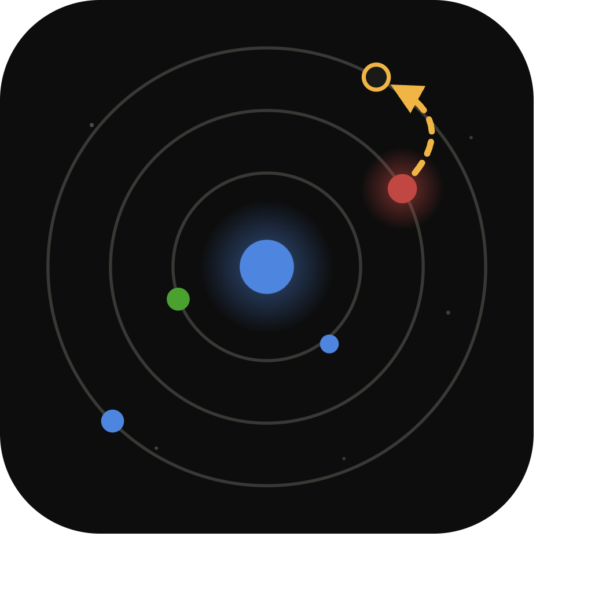</p>

# Orrery — see the blast radius before it hits

> An **orrery** is a clockwork model of the solar system — small enough to sit on a desk, true enough to predict an eclipse.
> **This one is a clockwork model of your data estate — true enough to predict which dashboards go dark.**

**An infinite canvas where every node of your DataHub lineage graph is a live data-profiling card.** Zoom out and your estate is a constellation colored by data health. Zoom in and each dataset becomes a full Trifacta-style profile — type inference, null bars, histograms, value frequencies — computed in your browser by DuckDB-Wasm. Click a broken column and watch the incident propagate downstream along **real DataHub lineage** to the ML models and dashboards it silently poisons. Then write the findings back to DataHub through the **official DataHub MCP server**, so the next person — or the next agent — inherits what Orrery observed.

Built for **Build with DataHub: The Agent Hackathon** (Open/Wildcard, with a foot in Production ML Agents).

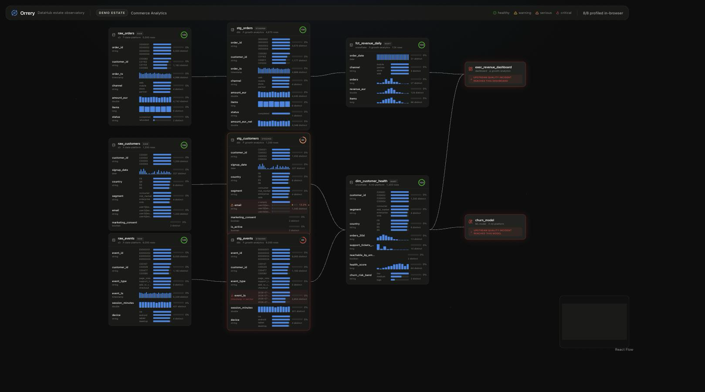

## Why this exists

Data catalogs know what *should* be true (schemas, lineage, ownership). Profilers know what *is* true (nulls, types, distributions). They almost never meet. Orrery joins them on one canvas:

- **DataHub supplies the context graph** — which datasets exist, their declared schemas, who owns them, and what is downstream of what.
- **DuckDB-Wasm supplies the observed truth** — every dataset is profiled live, in-browser, no warehouse connection needed.
- **The delta is the product** — a column declared `timestamp` in DataHub whose observed values are 9% epoch-millis integers is a *contract violation*, and because lineage is real, Orrery shows exactly which model and which executive dashboard that violation reaches, and which teams to notify.
- **Findings flow back into DataHub** via MCP mutations (`update_description`, `add_tags`, `save_document`), closing the agent loop: read context → act → write knowledge back.
- **Incidents get a price tag** — the impact panel estimates business exposure from the data itself: how much revenue per day the affected dashboards steer (measured live in DuckDB from the estate's own numbers), how many at-risk customers the affected model acts on, and a repair-effort estimate whose assumptions are printed next to it. Framed by the 1-10-100 data-quality cost rule: Orrery catches incidents at the staging layer, before the 100× zone.

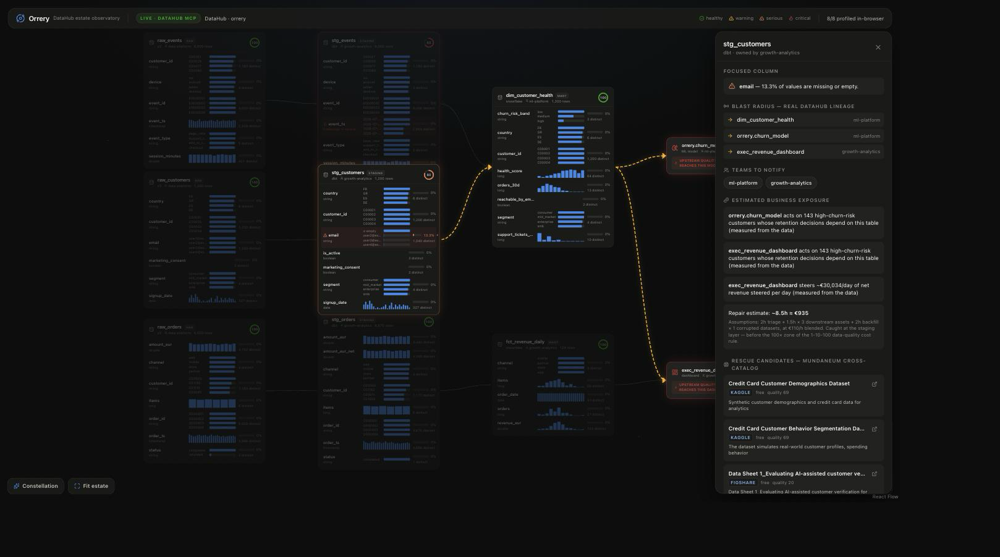

- **Broken dependencies get a lifeboat** — for datasets with serious incidents, Orrery ranks replacement/backfill candidates from the [Mundaneum](https://github.com/zetabytelab/datasetbib) cross-catalog directory (40k+ datasets across Databricks Marketplace, Snowflake Marketplace, Kaggle, Hugging Face, Datarade, data.gov…), and files them into DataHub as a rescue-proposal document tied to the damaged asset. Detect → blast radius → notify → **replace** — the full incident lifecycle, recorded in the catalog.

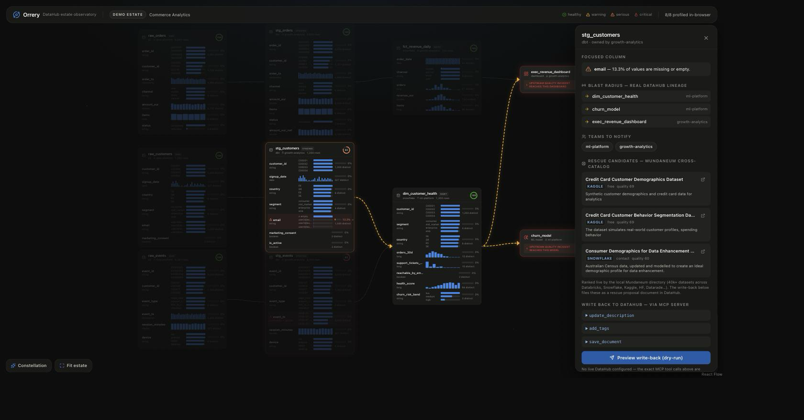

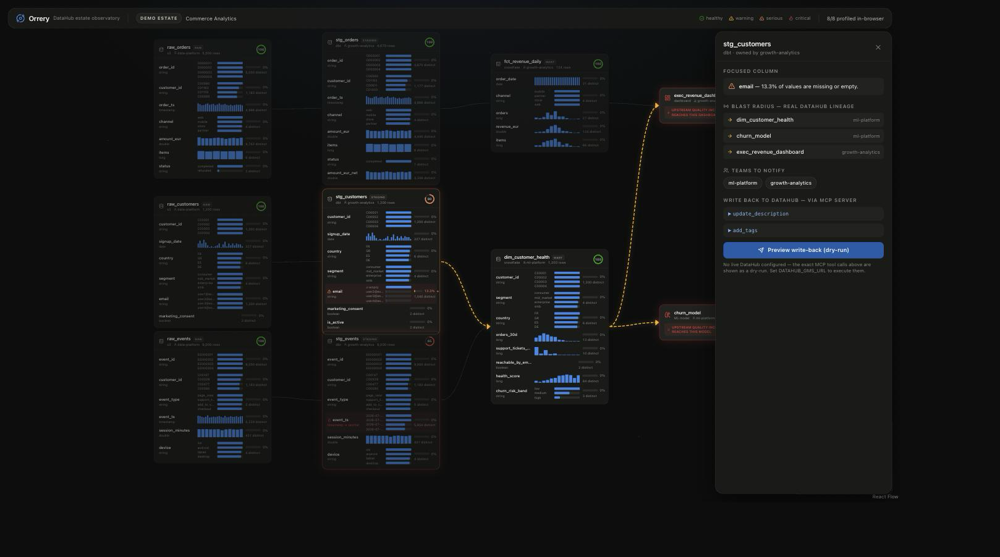

Zoomed out, the same canvas becomes the constellation view — the whole estate at a glance, colored by observed health (use the **Constellation** / **Fit estate** buttons, or just scroll):

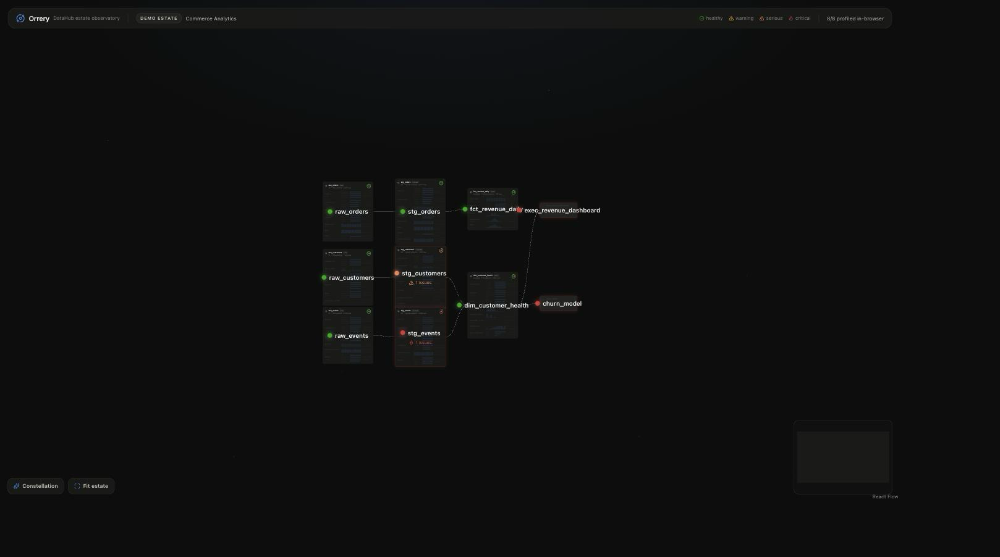

## Quick start (zero configuration)

Requires Node.js ≥ 22.13.

```bash
npm install
npm run dev
# open http://localhost:3000
```

That's it. With no DataHub configured, Orrery renders the bundled demo estate (a synthetic commerce stack: 3 raw datasets → 3 staging → 2 marts → churn model + executive dashboard, ~15k rows of deterministic synthetic data with two seeded quality incidents). Profiling runs in your browser; write-back renders as a dry-run showing the exact MCP tool calls it would send.

**The two incidents to look for:**

1. `stg_customers.email` — a consent-scrubber bug blanked ~13% of emails. Click the column: the spike propagates to `dim_customer_health` → `churn_model` + `exec_revenue_dashboard`.
2. `stg_events.event_ts` — declared `timestamp` in DataHub, but an upstream producer started emitting epoch-millis for ~9% of rows, silently degrading every downstream time-based feature.

## Live mode (real DataHub)

Orrery reads and writes DataHub exclusively through the [official DataHub MCP server](https://docs.datahub.com/docs/features/feature-guides/mcp) (`mcp-server-datahub`, spawned via `uvx` — install [uv](https://docs.astral.sh/uv/) if you don't have it).

```bash
# 1. Start DataHub (any instance works; quickstart shown)
uvx --from acryl-datahub datahub docker quickstart

# 2. Ingest the demo estate (datasets, schemas, owners, tags, lineage, consumers)
cd ingest
DATAHUB_GMS_URL=http://localhost:8080 uv run --with acryl-datahub python ingest_estate.py

# 3. Run Orrery against it
DATAHUB_GMS_URL=http://localhost:8080 DATAHUB_GMS_TOKEN=<token-if-auth-enabled> npm run dev
```

The top bar flips to **LIVE · DATAHUB MCP** (verified end-to-end against DataHub quickstart v1.7.0 — `docs/live-writeback.png` shows a real run whose three MCP mutations all returned `success: true`):

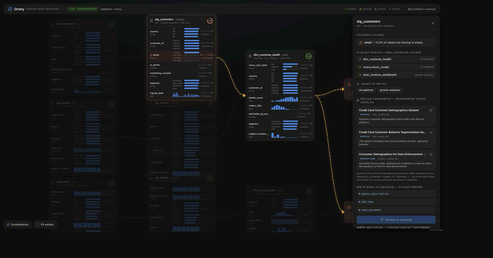

And this is what the next person opening DataHub inherits — the profile note and severity tag on the asset, and the rescue proposal filed as a first-class DataHub Document related to it:

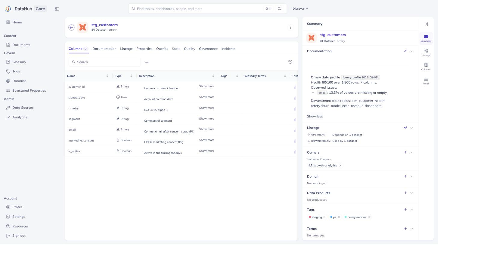

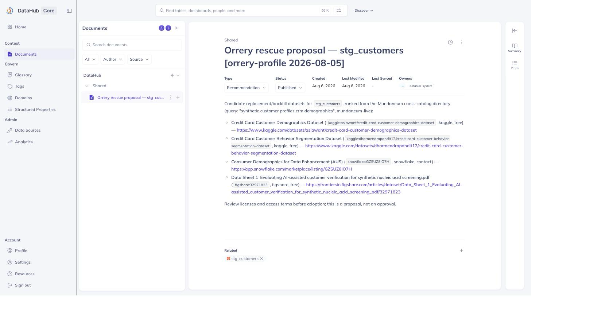

Write-back goes down to the **column level** — the drifting `event_ts` field carries its `orrery-critical` tag and an observed-profile note directly in DataHub's schema table, and the whole estate (grouped under a Commerce Analytics domain) renders in DataHub's own lineage explorer, ML model included:

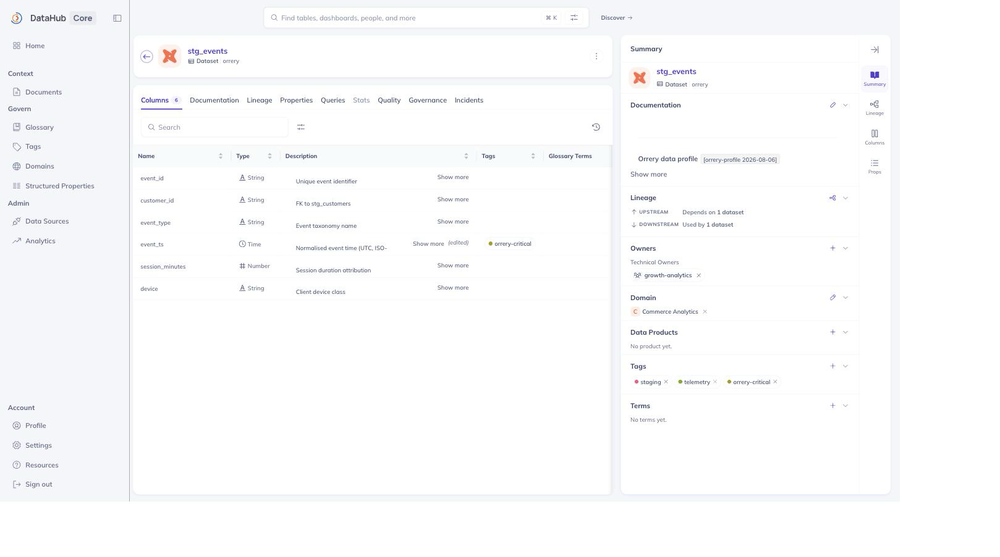

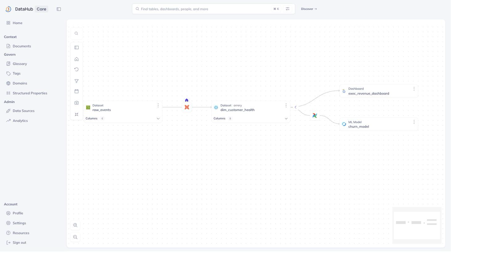 Now the estate graph (entities, schemas, ownership, lineage) comes from MCP `search` + `list_schema_fields` + `get_lineage`, and the write-back button executes real `update_description` + `add_tags` mutations — the applied tags (`orrery-warning|serious|critical`) and profile notes are visible in the DataHub UI afterwards. Datasets whose names match the bundled CSVs are profiled with local data; anything else in your DataHub renders as metadata-only cards on the same canvas.

Environment variables:

| Variable | Purpose |
|---|---|
| `DATAHUB_GMS_URL` | DataHub GMS endpoint; presence of this switches Orrery to live mode |
| `DATAHUB_GMS_TOKEN` | Personal access token, if your instance has auth enabled |
| `ORRERY_DATAHUB_QUERY` | Search query used to select the estate (default `orrery`) |

## How it works

```
┌────────────────────────── browser ──────────────────────────┐
│  React Flow infinite canvas (semantic zoom, dagre layout)   │
│  DuckDB-Wasm profiling engine (types, nulls, histograms,    │
│   top-k, pattern analysis, contract checks vs DataHub)      │
└──────────────┬──────────────────────────────────────────────┘
               │ /api/context          /api/writeback
┌──────────────┴──────────────────────────────────────────────┐
│  Next.js API routes — MCP client (stdio)                    │
│    └─ uvx mcp-server-datahub  ⇄  DataHub GMS                │
│  fixture fallback: fixtures/estate.json (no DataHub needed) │
└─────────────────────────────────────────────────────────────┘
```

- **Profiling** (`lib/profile.ts`): each CSV is loaded into DuckDB-Wasm; per column it computes missing %, distinct counts, min/max, 12-bin histograms (numeric), daily histograms (temporal), top-k frequencies and regex pattern breakdowns (text). Declared types from the DataHub schema are checked against observed types — mismatches become contract-violation / type-drift issues.
- **Propagation**: selecting a dataset or column computes the transitive downstream closure over the DataHub lineage edges and animates the blast radius; ML models and dashboards display an "upstream quality incident" badge whenever any transitive upstream has an issue.
- **Write-back** (`app/api/writeback/route.ts`): an allowlisted plan of MCP mutation calls (a deterministic run-marked profile note plus a severity tag), previewed in the UI before sending; dry-run when no DataHub is configured.

## From demo to your estate

Nothing in the pipeline is demo-specific. The canvas renders whatever `/api/context` returns (any DataHub instance via MCP), and the profiler runs on whatever CSVs sit in `public/estate/` — drop in exports of your own tables with matching names and the same contract checks, propagation, and write-back apply. The natural production path is connector-based (profile directly from the warehouse via DuckDB's Parquet/HTTP readers instead of bundled CSVs); that is roadmap, not fiction — the profiling SQL is already engine-agnostic.

## Repository map

```
app/               Next.js app — canvas page + /api/context + /api/writeback
components/        EstateCanvas, DatasetNode, ConsumerNode, ImpactPanel, micro-charts
lib/               profiling engine, DuckDB bootstrap, DataHub MCP client, types
fixtures/          estate.json — the DataHub-shaped demo context
data/              deterministic synthetic-estate generator (writes public/estate)
ingest/            ingest_estate.py — load the demo estate into a real DataHub
examples/          sample outputs: dataset profiles + the write-back plan JSON
docs/              screenshots
```

## Provenance & license

All application code in this repository was written during the hackathon submission period. Pre-existing tools used as dependencies: Next.js, React Flow (@xyflow/react), DuckDB-Wasm, dagre, lucide icons, the MCP TypeScript SDK, and the DataHub MCP server + acryl-datahub SDK. The demo estate is synthetic and deterministic; no real customer data is used or contacted.

Licensed under the [Apache License 2.0](LICENSE).
